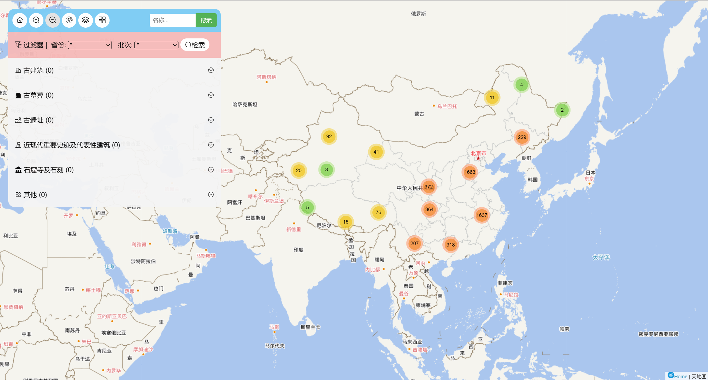
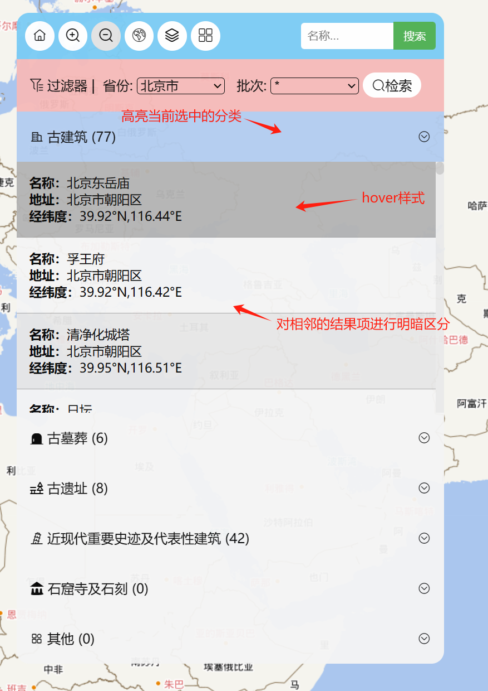
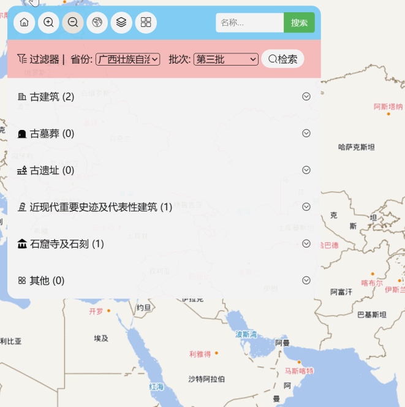
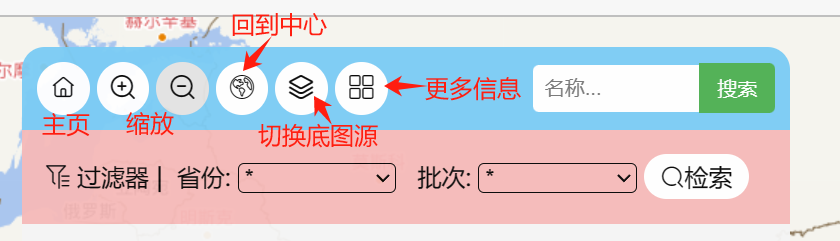
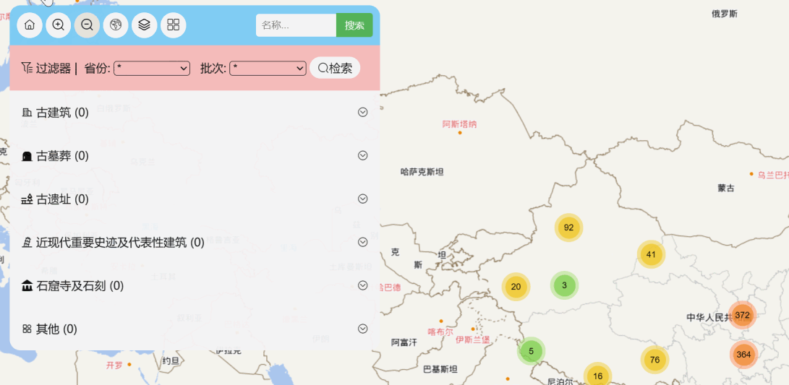
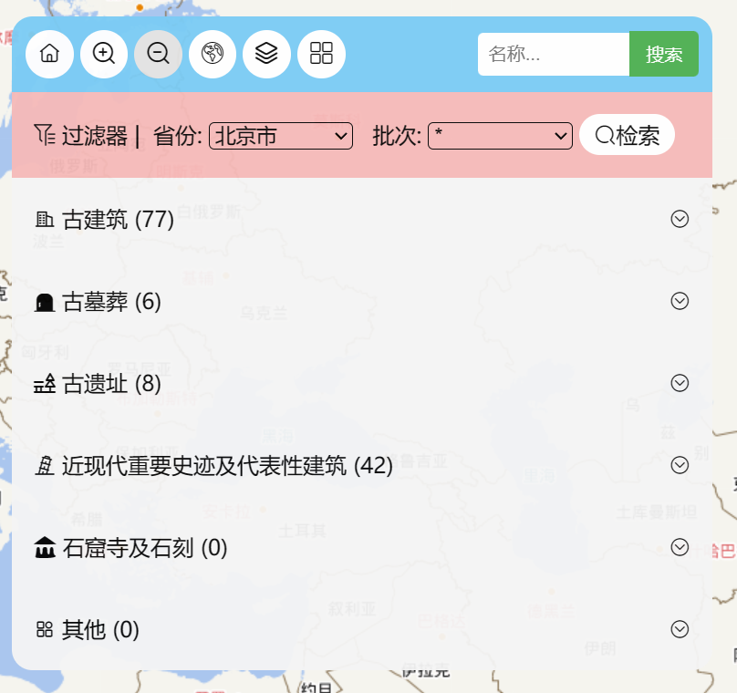
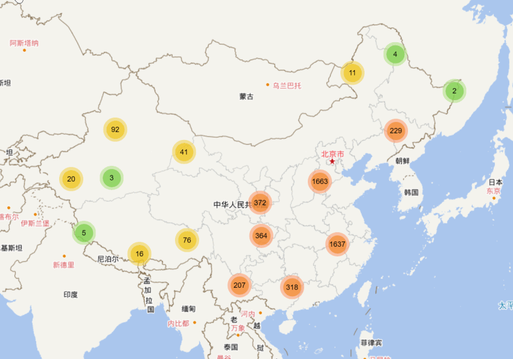
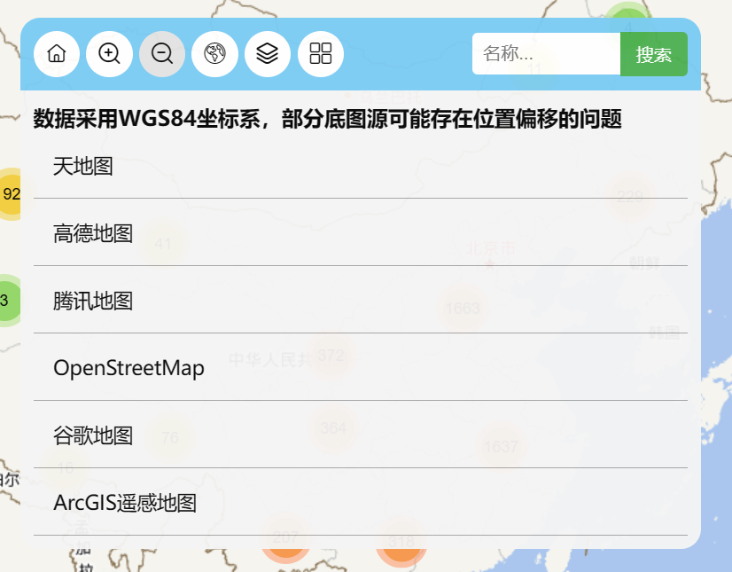
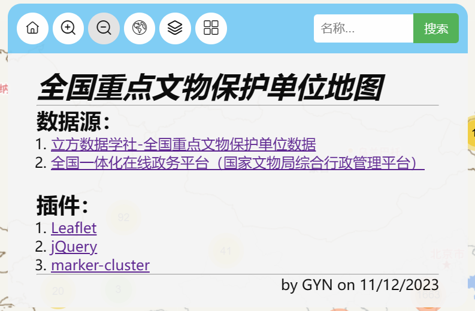

# *全国重点文物保护单位地图*

## Github仓库

[➡仓库链接](https://github.com/moonlight216/moonlight216.github.io)

## 数据源

1. [立方数据学社-全国重点文物保护单位数据](https://mp.weixin.qq.com/s/Rf9V-mOu3B8lu93F1unVgg)
2. [全国一体化在线政务平台（国家文物局综合行政管理平台）](http://gl.ncha.gov.cn/#/public-service)

## 所用插件

1. [Leaflet](https://leafletjs.com/)
2. [jQuery](https://jquery.com/)
3. [marker-cluster](https://github.com/Leaflet/Leaflet.markercluster)
4. [iconfont](https://www.iconfont.cn/)

## ✨网页简介

### 0.总结

①整体界面美观简洁，注重细节，对大部分用户操作结果都进行了平滑过渡。

②实现了搜索、过滤数据、切换数据源的功能，并对结果进行分类和数量统计。

③多页面切换，包括主页、数据源页、更多信息页，有限的空间内展示了更多内容。

### 1.界面

①🌟界面如图(1)所示，主要包含了1个**【可拖动的】**综合地图控件（有切换图层、缩放地图、数据过滤、搜索等功能）和1个地图容器。

②设计了网页的图标，以及右下角的注记，点击Home标签可以链接到网页的github库。

(图1)网页界面

### 2.UI和交互设计

①🌟对于过滤器和搜索所得结果的信息窗口，主要进行了如图(2)中左图所示的UI设计，**高亮当前选中的分类项、设计hover的样式、对相邻结果进行了明暗区分**。

②🌟**动态收缩结果列表**，如图(2)中右图所示。

③**对滚动条样式进行了重新设计**，更符合整体的UI设计风格。

④界面多采用圆角设计，与iconfont图标进行结合，更加美观。

⑤对标记点的样式进行了设计。

​					

(图2)UI设计

### 3.地图Toolbar

①🌟实现如图(3)所示的功能：**主页、缩放、回到中心、切换底图源、更多信息**。缩放按钮会根据Map的缩放倍数禁用或启用，禁用则为灰色。

(图3)Toolbar

②🌟**搜索功能**：比如搜索“天”字，**搜索结果窗口中包含了【结果数量】的统计**。**在点击列表中的结果之后，可以跳转到对应的标记点**，如图(4)所示。

(图4)搜索功能

③🌟**过滤器功能：**可以根据“省份”和“批次”进行**多条件过滤**，若过滤条件为“*”，则为“选择该条件下的所有元素”。**我对结果进行分类展示，并标注出每个分类下的结果数量。**所过滤的结果均可**跳转到对应的标记点**，如图(5)所示。

(图5)过滤结果

### 4.MarkerCluster插件展示

由于数据量较大，我使用了这一插件进行了平滑加载。MarkerCluster插件实现了**点聚合**的功能，并提供了动画。如图(6)所示。

(图6)MarkerCluster

### 5.更换底图源

点击Toolbar上的可以切换到底图源页面，在这一页面可以**更换目前主流的底图源**，部分底图源由于坐标系与数据源所用坐标系不同，会导致标记点偏移。再次点击后可以回到过滤器主页。如图(7)所示。

(图7)更换底图源

### 6.更多信息展示

点击Toolbar上的可以切换到更多信息的页面，展示了数据源和所用插件的列表。如图(8)所示。

(图8)更多信息

------

11/13/2023 by GYN

